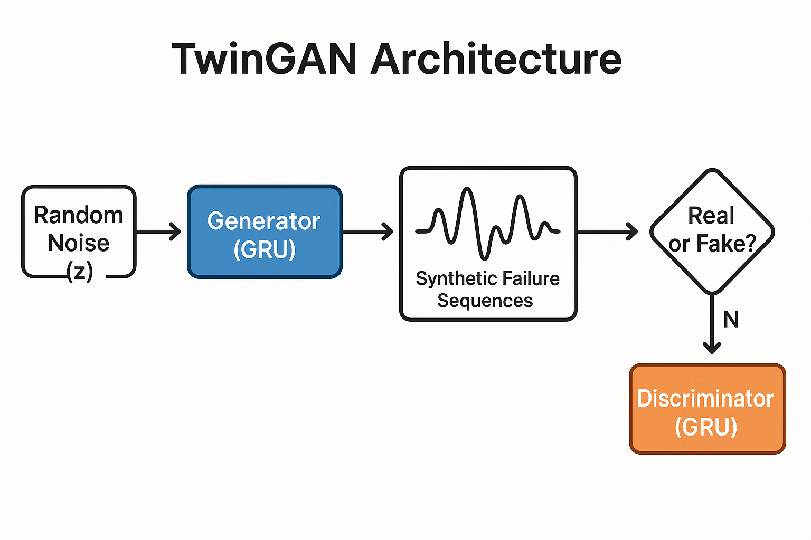
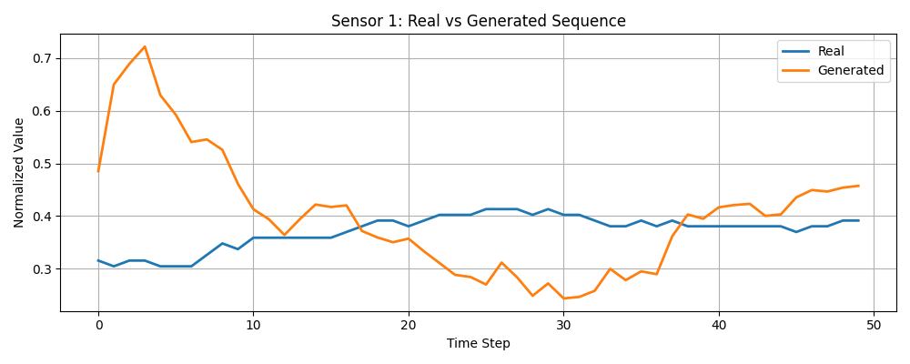
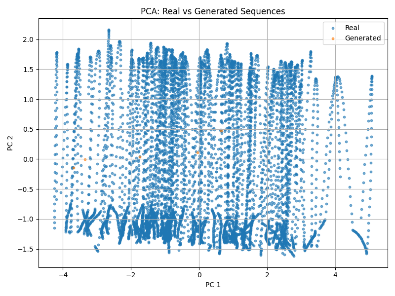
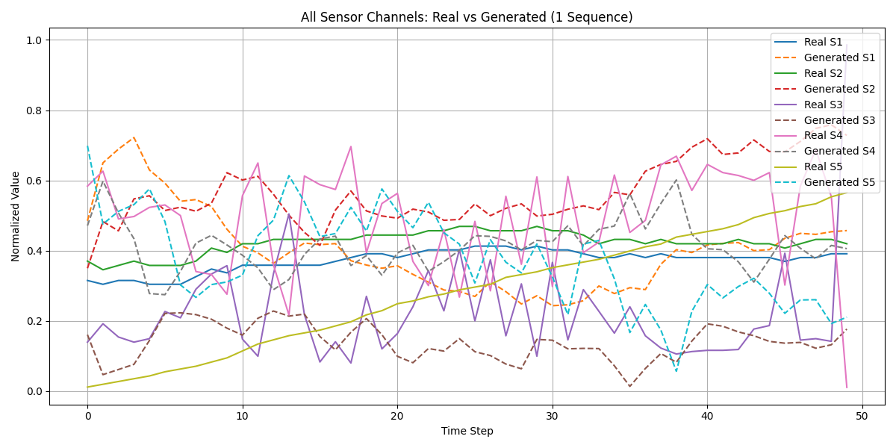
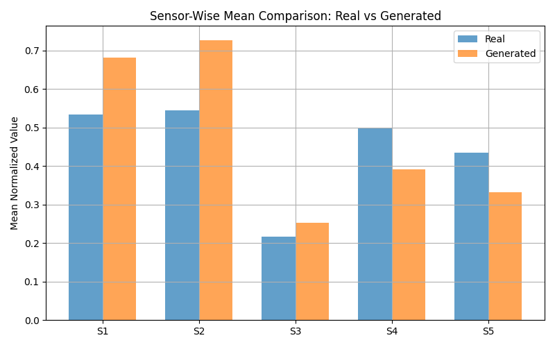
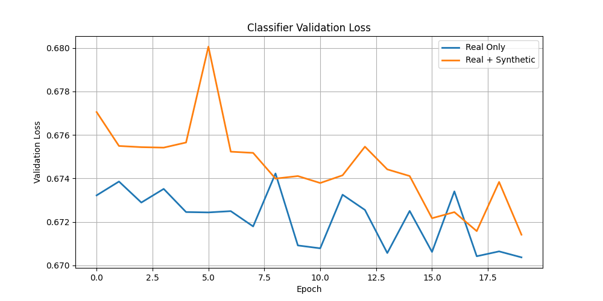

# TwinGAN: Generative Digital Twin for Rare Failure Simulation

**Simulate machine failures using GANs to improve predictive maintenance models.**  
This project trains a time-series GAN to generate synthetic failure sequences based on real sensor data — enabling better ML performance even when real-world failures are rare.

---

## Project Overview

Industrial datasets often lack sufficient examples of failure — making it hard for ML models to generalize.  
**TwinGAN solves this by generating synthetic failure sequences** using a GRU-based GAN trained on rare failure windows from the AI4I 2020 dataset.

---

## Architecture


```text
[Random Noise] → [Generator (GRU)] → Synthetic Failures → [Discriminator (GRU)] → Real or Fake?
```

## Structure
```
TwinGAN/
├── data/           # Raw and preprocessed datasets (e.g., CMAPSS, AI4I)
├── gan_model/      # GAN model code (TimeGAN, RNN-GAN)
├── classifier/     # Predictive models trained on real + synthetic data
├── notebooks/      # Jupyter notebooks for experiments & validation
├── plots/          # All generated plots and visualizations
├── utils/          # Normalization, preprocessing, etc.
├── reports/        # Result summary PDFs, logs, etc.
```

## Tech Stack
- PyTorch (GANs)
- NumPy, pandas, matplotlib
- t-SNE / PCA for visualization
- CMAPSS or AI4I datasets

## Use Case
Augment rare failure examples to train better predictive maintenance models in industrial settings.

## Setup
```bash
pip install -r requirements.txt
```

## Dataset
Source: AI4I 2020 Predictive Maintenance Dataset

10,000+ records of simulated CNC machine operations

5 key features:
- Air temperature [K]
- Process temperature [K]
- Rotational speed [rpm]
- Torque [Nm]
- Tool wear [min]

## How It Works

### Preprocessing
- Convert flat tabular data into **fixed-length time windows** (50 timesteps)
- Normalize all sensor values using `MinMaxScaler`
- Save:
  - `X_real.npy`: Normal + failure data
  - `X_fail.npy`: Failure-only sequences

---

### Training the GAN
- **Generator (GRU)** learns to produce time-series failure patterns from random noise
- **Discriminator (GRU)** tries to classify sequences as real or synthetic
- Both networks improve iteratively via adversarial training
- Training loss logs are printed every 10 epochs
- Output:
  - Trained models: `generator.pth`, `discriminator.pth`
  - Sample outputs: `generated_samples.npy`

---

### Visualization
- Visual comparisons between **real vs generated** sequences
- Key plots:
  - `sequence_comparison.png`: Sensor 1 overlay
  - `pca_comparison.png`: PCA plot of real vs synthetic
  - `all_sensors_comparison.png`: Overlay across all 5 sensors
  - `sensor_means_barplot.png`: Sensor-wise mean values

---

### Downstream Classifier
- Trained an **LSTM binary classifier** to predict machine failure
- Comparison between:
  - ✅ Model trained on **real-only data** (`X_real + X_fail`)
  - ✅ Model trained on **real + GAN-augmented data**
- Evaluation includes:
  - Validation loss curve (`classifier_loss_comparison.png`)
  - Confusion matrices
  - ROC and Precision-Recall curves

## Sample Results

### Sensor 1 Overlay


### PCA: Real vs Generated


### All Sensors Overlay


### Sensor Mean Distribution


### Classifier Performance


## Blog

I’ve written a detailed blog walking through every part of this project, including visualizations and evaluation results.

[How I Used GANs to Simulate Rare Machine Failures for Smarter Predictive Maintenance](https://medium.com/@myakalarajkumar1998/how-i-used-gans-to-simulate-rare-machine-failures-for-smarter-predictive-maintenance-33957d606eb9)

## Author

**Raj Kumar Myakala**  
Software Developer | AI Researcher | IEEE & ACM Member  
[LinkedIn](https://www.linkedin.com/in/raj-kumar-myakala-927860264/)  
[All Blogs](https://medium.com/@myakalarajkumar1998)

If you found this helpful or want to collaborate, feel free to connect!

